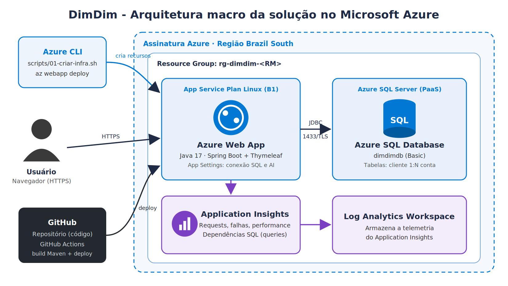

# DimDim Web App · Java + Azure SQL + Application Insights

Checkpoint 2 (2º semestre) da disciplina **DevOps Tools & Cloud Computing** · FIAP · Prof. João Menk

## Integrantes

| Nome | RM |
|------|----|
| Joao Paulo Francisco de Oliveira | RM557410 |
| Marcelo Antônio Scoleso Junior| RM000000 |


**Vídeo com as evidências:** https://youtu.be/SEU_LINK_AQUI

---

## 1. Descrição da solução

A **DimDim** é uma instituição financeira que contratou a consultoria do grupo para levar sua aplicação de cadastro para a nuvem. A solução é uma aplicação web em **Java 17 com Spring Boot e Thymeleaf (front-end)** que permite:

- **Clientes**: cadastrar, listar, editar e excluir clientes do banco.
- **Contas**: abrir, listar, editar e encerrar contas (corrente, poupança ou salário) vinculadas a um cliente.

As duas tabelas têm relacionamento **1:N** (um cliente possui várias contas, via FK `conta.cliente_id`). A aplicação roda no **Azure App Service (Linux)**, persiste os dados no **Azure SQL Database (PaaS, não containerizado)** e é monitorada pelo **Application Insights**, que coleta requisições, falhas, performance e as **dependências SQL** (as queries feitas no banco). O deploy é automatizado com **Azure CLI + GitHub Actions**, com uma alternativa via **Azure CLI + `az webapp deploy`**.

Além do front-end, o mesmo CRUD está exposto em REST em `/api` (JSON em [`docs/api-json.md`](docs/api-json.md)).

## 2. Arquitetura



| Recurso | Nome | Função |
|---|---|---|
| Resource Group | `rg-dimdim-<RM>` | Agrupa todos os recursos |
| App Service Plan | `plan-dimdim-<RM>` (Linux B1) | Capacidade de computação |
| Web App | `dimdim-webapp-<RM>` (Java 17) | Hospeda a aplicação |
| Azure SQL Server / Database | `sql-dimdim-<RM>` / `dimdimdb` | Banco PaaS |
| Application Insights | `ai-dimdim-<RM>` | Monitoramento do App e do Banco |
| Log Analytics | `log-dimdim-<RM>` | Armazena a telemetria |

## 3. Tecnologias

Java 17 · Spring Boot 3.3 · Spring Data JPA · Thymeleaf · Driver mssql-jdbc · Application Insights Java Agent (runtime attach) · Azure CLI · GitHub Actions

## 4. Estrutura do repositório

```
├── .github/workflows/deploy.yml        # pipeline de build e deploy
├── docs/
│   ├── arquitetura.png / .svg          # desenho da arquitetura
│   ├── api-json.md                     # JSON das operações GET, POST, PUT, DELETE
│   └── roteiro-video.md
├── scripts/
│   ├── ddl.sql                         # DDL das tabelas
│   ├── consultas-evidencias.sql        # SELECTs para evidenciar a persistência
│   ├── 01-criar-infra.sh               # cria todos os recursos via Azure CLI
│   ├── 02-deploy-az-webapp.sh          # deploy via az webapp deploy
│   ├── 03-configurar-github-actions.sh # prepara o deploy via GitHub Actions
│   └── 99-remover-recursos.sh          # apaga tudo no final
└── src/main/...                        # código fonte
```

## 5. Segurança

Nenhuma credencial fica no código. Usuário, senha e URL do banco e a connection string do Application Insights são lidos de variáveis de ambiente (`application.properties` usa `${SPRING_DATASOURCE_URL}` etc.), configuradas como **App Settings** do Web App pelo script de infra. A senha do SQL é informada no terminal ou via `export`, e o publish profile vira **secret** do GitHub.

---

## 6. How to: implantação completa na nuvem

### Pré-requisitos

- Conta Azure com assinatura ativa
- [Azure CLI](https://learn.microsoft.com/cli/azure/install-azure-cli) instalado
- Git, Java 17 e Maven (só se for usar o deploy pela CLI)
- [GitHub CLI](https://cli.github.com/) (opcional, para gravar os secrets automaticamente)
- Terminal bash (Linux, macOS, WSL ou Git Bash no Windows). Também funciona no **Azure Cloud Shell**.

### Passo 1: clonar o repositório

```bash
git clone https://github.com/SEU_USUARIO/dimdim-webapp.git
cd dimdim-webapp
chmod +x scripts/*.sh
```

### Passo 2: login no Azure

```bash
az login
az account show -o table   # confira a assinatura
```

### Passo 3: criar a infraestrutura

```bash
export RM=557123                              # RM de um integrante (deixa os nomes únicos)
export SQL_ADMIN_PASSWORD='SuaSenhaForte@2026'
./scripts/01-criar-infra.sh
```

O script cria Resource Group, SQL Server, Database, regras de firewall (serviços do Azure + seu IP), Log Analytics, Application Insights, App Service Plan e Web App, e já configura os App Settings.

> Se a região `brazilsouth` não estiver liberada na sua assinatura, use `export LOCATION=eastus` antes do script.

### Passo 4: criar as tabelas (DDL)

1. Portal Azure > **SQL databases** > `dimdimdb` > **Query editor (preview)**
2. Login com `dimdimadmin` e a senha definida
3. Cole e execute o conteúdo de [`scripts/ddl.sql`](scripts/ddl.sql)

Alternativa com sqlcmd:
```bash
sqlcmd -S sql-dimdim-$RM.database.windows.net -d dimdimdb -U dimdimadmin -P "$SQL_ADMIN_PASSWORD" -i scripts/ddl.sql
```

### Passo 5: deploy automatizado

**Opção A: Azure CLI + GitHub Actions (principal)**

```bash
gh auth login                                  # se for usar o GitHub CLI
./scripts/03-configurar-github-actions.sh
git push origin main                           # dispara o workflow
```

O script habilita as credenciais de publicação, gera o publish profile e grava os secrets `AZURE_WEBAPP_NAME` e `AZURE_WEBAPP_PUBLISH_PROFILE`. Acompanhe em **Actions** no GitHub. Também dá para rodar manualmente em **Actions > Build e Deploy > Run workflow**.

**Opção B: Azure CLI + az webapp deploy**

```bash
./scripts/02-deploy-az-webapp.sh
```

### Passo 6: testar

Acesse `https://dimdim-webapp-<RM>.azurewebsites.net` (o primeiro acesso pode levar cerca de 1 minuto).

1. **Clientes > Cadastrar cliente**, depois editar e excluir
2. **Contas > Abrir conta** escolhendo o titular, depois editar saldo e excluir
3. Após cada operação, rode [`scripts/consultas-evidencias.sql`](scripts/consultas-evidencias.sql) no Query editor para ver a persistência

Teste da API: exemplos em [`docs/api-json.md`](docs/api-json.md).

### Passo 7: monitoramento

Portal Azure > `ai-dimdim-<RM>`:

- **Live metrics**: requisições em tempo real enquanto usa a aplicação
- **Application map**: Web App chamando o SQL Database
- **Transaction search**: cada requisição com a query SQL executada
- **Performance / Failures**: tempo de resposta das operações e das dependências SQL

No banco: `dimdimdb` > **Metrics** (DTU, conexões) e **Query Performance Insight**.

### Passo 8: remover os recursos

```bash
./scripts/99-remover-recursos.sh
```

### Troubleshooting

| Problema | Solução |
|---|---|
| Página 503/erro ao iniciar | Veja `az webapp log tail -g rg-dimdim-$RM -n dimdim-webapp-$RM` |
| Erro de login no SQL | Confira os App Settings `SPRING_DATASOURCE_*` |
| Query editor bloqueado | Adicione seu IP em SQL Server > Networking |
| Deploy do Actions falha com 401 | Rode de novo o script 03 (basic auth precisa estar habilitado) |
| Sem dados no Application Insights | Espere 2 a 3 minutos e confira `APPLICATIONINSIGHTS_CONNECTION_STRING` |
